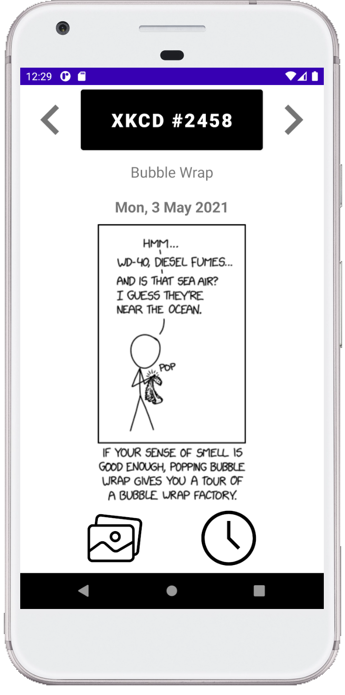
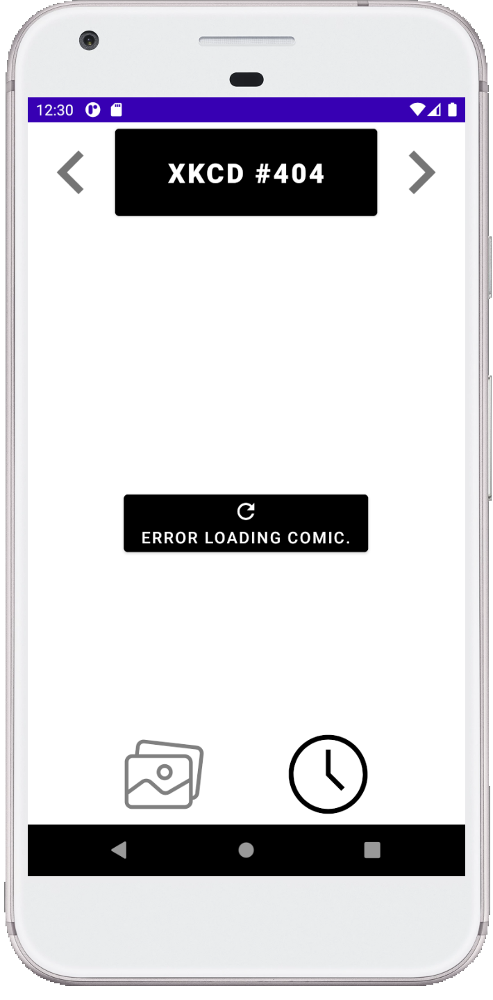
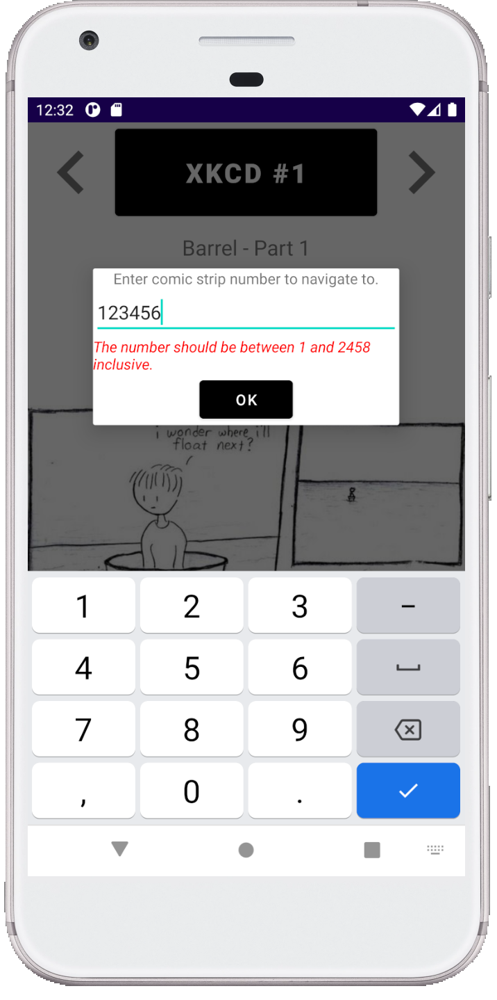

# XKCD Browser

  
  
  

### User Story #1 - Aktuelles Comic anzeigen

Der Benutzer hat die Möglichkeit, das aktuelle Comic in der App anzuzeigen. Die Nummer des Comics, der Titel, das Datum und das Bild werden auch in der App angezeigt. Das Bild wird automatisch geladen und während das Bild geladen wird, wird ein Platzhalter angezeigt. Außerdem kann der Benutzer in das Bild zoomen und den angezeigten Ausschnitt anpassen.

### User Story #2 - alt-Text für das Comic anzeigen

Alle Comics haben einen alt-Text (`alt`) der auf der Webseite angezeigt wird. Die App soll diesen Text nach einem Longpress auf dem Bild anzeigen. Der Text soll automatisch nach ein paar Sekunden wieder verschwinden.

### User Story #3 - Zum nächsten und vorherigen Comic springen

Der Benutzer hat die Möglichkeit, das nächste und das vorherige Comic auszuwählen. Wenn das gewünschte Comic nicht existiert, wird ein Fehler angezeigt werden.

### User Story #4 - Ein zufälliges Comic auswählen

Der Benutzer hat die Möglichkeit, ein zufälliges Comic auszuwählen. Der Benutzer kann auch zum aktuellen Comic zurück gehen.

### User Story #5 - Ein Comic als Favorit speichern

Der Benutzer hat die Möglichkeit, das Comic als Favorit in die Fotomediathek abzuspeichern.
